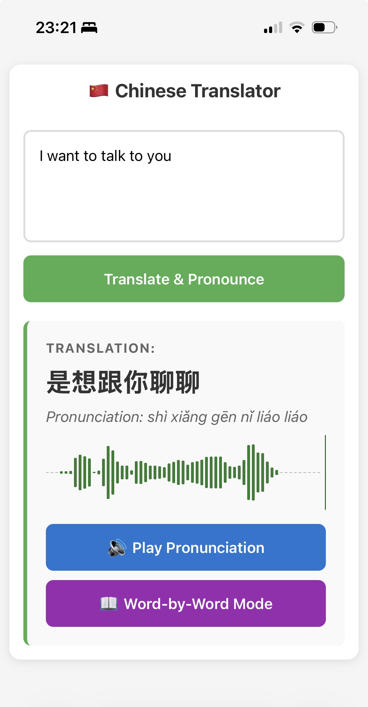

# Chinese Translator 🇨🇳

A Go-based web application for learning Chinese with English-to-Chinese translation, pinyin pronunciation, and audio playback.



## Features

- **Translation**: English to Chinese using MyMemory API
- **Pinyin**: Romanized pronunciation with tone marks
- **Audio**: Google TTS pronunciation playback
- **Waveform Visualization**: Interactive audio waveform with WaveSurfer.js
- **Word-by-Word Mode**: Learn character-by-character with individual pronunciation
- **Mobile-Friendly**: Responsive design optimized for iPhone and mobile devices

## Tech Stack

- **Backend**: Go (net/http)
- **Translation API**: MyMemory (free, no API key)
- **TTS**: Google Translate Text-to-Speech
- **Pinyin**: go-pinyin library
- **Audio Visualization**: WaveSurfer.js
- **Deployment**: Railway

## Endpoints

- `GET /translator` - Demo page
- `POST /translate` - Translate text
- `GET /pronounce` - Get audio pronunciation

## Local Development

```bash
go mod download
go run .
```

Visit `http://localhost:8080/translator`

## Deployment

Deployed on Railway with automatic deployments from GitHub.
